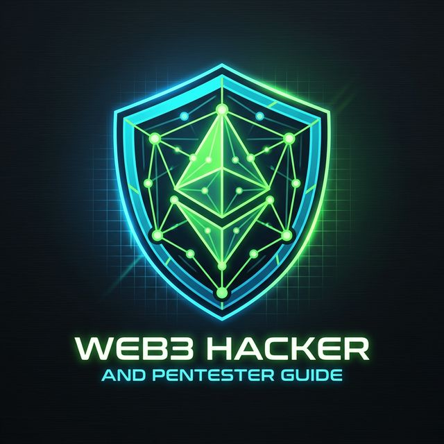

<p align="center">
  
</p>
 <h1 align="center">Web3 Hacker & Pentester Guide</h1> 
<p align="center">
  <a href="./INDEX.md">
    
  </a>
  <a href="./INDEX.md">
    
  </a>
  <a href="https://github.com/">
    
  </a>
  <a href="./LICENSE">
    
  </a>
  <a href="https://sdxshadow.github.io/Hack_web3/">
    
  </a>
  <a href="https://www.instagram.com/sdxshadow/">
    
  </a>
</p>

  > This guide is for **authorized security research and education only**. All techniques must be practiced on testnets, forks, or with explicit written permission. Unauthorized access to any system is illegal. The authors are not responsible for misuse.

---

## Quick Navigation

| # | Module | Topics | Difficulty |
|---|--------|---------|-----------|
| 01 | [Blockchain Fundamentals](./modules/BLOCKCHAIN_FUNDAMENTALS.md) | EVM internals, ABI, gas, L2, bridges |  →  |
| 02 | [Recon & OSINT](./modules/RECON_AND_OSINT.md) | Etherscan, Tenderly, Dune, proxy detection |  →  |
| 03 | [Smart Contract Vulnerabilities](./modules/SMART_CONTRACT_VULNERABILITIES.md) | Reentrancy, flash loans, oracles, access control |  →  |
| 04 | [Audit Methodology](./modules/AUDIT_METHODOLOGY.md) | Scoping, threat modeling, invariants, CEI |  →  |
| 05 | [Tools & Frameworks](./modules/TOOLS_AND_FRAMEWORKS.md) | Foundry, Slither, Echidna, Certora |  |
| 06 | [Exploit Development](./modules/EXPLOIT_DEVELOPMENT.md) | Foundry PoC writing, flash loan templates |  |
| 07 | [DeFi Protocol Attacks](./modules/DEFI_PROTOCOL_ATTACKS.md) | AMM, lending, bridges, governance |  →  |
| 08 | [Web3 dApp Pentesting](./modules/WEB3_DAPP_PENTESTING.md) | Wallet, frontend, RPC, ENS, phishing |  →  |
| 09 | [MEV & Mempool](./modules/MEV_AND_MEMPOOL.md) | Sandwich attacks, Flashbots, PBS |  →  |
| 10 | [CTF & Wargames](./modules/CTF_AND_WARGAMES.md) | Ethernaut, DvD, Paradigm CTF, Code4rena |  →  |
| 11 | [Reporting & Disclosure](./modules/REPORTING_AND_RESPONSIBLE_DISCLOSURE.md) | Finding templates, Immunefi, severity scoring |  |
| 12 | [Advanced Topics](./modules/ADVANCED_TOPICS.md) | ZK security, ERC-4337, cross-chain, EigenLayer |  |
| 13 | [Missing Vuln Classes](./modules/MISSING_VULN_CLASSES.md) | Transient storage, read-only reentrancy, weird ERC-20 |  →  |
| 14 | [Bug Bounty Playbook](./modules/BUG_BOUNTY_PLAYBOOK.md) | Target selection, sprint methodology, income tactics |  →  |
| 15 | [Exploit Recreations](./modules/EXPLOIT_RECREATIONS.md) | DAO, Harvest, Beanstalk, Nomad, Curve/Vyper |  →  |
| 16 | [Master Audit Checklist](./modules/AUDIT_CHECKLIST_MASTER.md) | Complete per-function and DeFi-specific checklists | All |

---

## Getting Started

### Prerequisites

- Basic Solidity understanding
- Node.js / npm installed
- Familiarity with Ethereum basics (transactions, wallets, gas)

### Lab Setup

```bash
# Install Foundry (required for all PoC exercises)
curl -L https://foundry.paradigm.xyz | bash && foundryup

# Install Slither
pip3 install slither-analyzer

# Clone this guide
git clone https://github.com/SdxShadow/Hack_web3
cd web3-pentest-guide

# Start with [Module 01](./modules/BLOCKCHAIN_FUNDAMENTALS.md)
```

### Recommended Learning Path

```
 Beginner (Weeks 1-4)
   → Modules 01, 02, 05, 10 (Fundamentals + Tools + CTFs)

 Intermediate (Weeks 5-8)
   → Modules 03, 04, 08, 11 (Vulnerabilities + Audit + Disclosure)

 Advanced (Weeks 9-14)
   → Modules 06, 07, 09, 13, 15 (Exploit Dev + DeFi + MEV)

 Expert (Ongoing)
   → Modules 12, 14, 16 + Live Immunefi / Code4rena contests
```

---

## Core Tool Stack

| Tool | Purpose | Install |
|------|---------|---------|
| **Foundry** | Testing, fuzzing, PoC development | `curl -L https://foundry.paradigm.xyz \| bash` |
| **Slither** | Static analysis | `pip3 install slither-analyzer` |
| **Echidna** | Property-based fuzzing | [GitHub releases](https://github.com/crytic/echidna/releases) |
| **Aderyn** | Fast AST analysis | `cargo install aderyn` |
| **Heimdall-rs** | Bytecode decompilation | `cargo install heimdall` |
| **Certora** | Formal verification | `pip3 install certora-cli` |

---

## Guide Statistics

- **17 modules** covering the full Web3 security spectrum
- **200+ vulnerability patterns** documented with PoC code
- **50+ real-world case studies** from $70M to $624M exploits
- **Foundry PoC templates** for every major attack vector
- **SEO-optimized** for GitHub Pages with Jekyll

---

## External Resources

- [Rekt News](https://rekt.news) — DeFi exploit post-mortems
- [DeFi Hack Labs](https://github.com/SunWeb3Sec/DeFiHackLabs) — 200+ PoCs
- [Immunefi](https://immunefi.com) — Bug bounty platform
- [Code4rena](https://code4rena.com) — Competitive audits
- [Secureum](https://secureum.substack.com) — Security education
- [Phalcon Explorer](https://phalcon.blocksec.com) — Transaction analysis

---

## License

MIT License — See [LICENSE](./LICENSE) for details.

---

*→ [Start with the Full Index & Guide Overview](./INDEX.md)*
